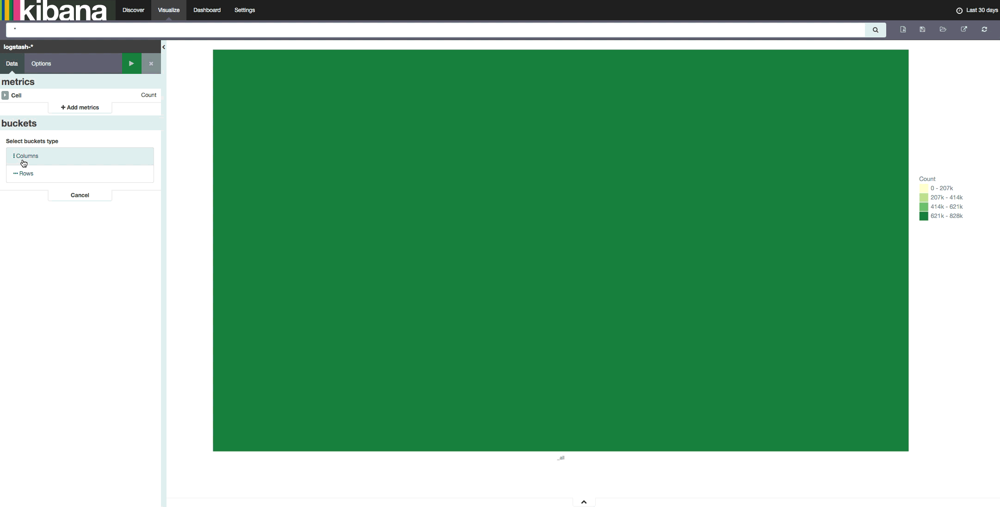

# Kibana Heatmap Plugin
A Heatmap Plugin for Kibana 4



### Requirements
Kibana 4.3+

### Installation steps
1. Download and unpack [Kibana](https://www.elastic.co/downloads/kibana).
2. From the Kibana root directory, install the plugin with the following command:

To install the version of this heatmap that works with Kibana 4.3 - 4.5:
```
$ bin/kibana plugin -i heatmap -u https://github.com/stormpython/heatmap/archive/1.0.0.zip
```

*Higher versions of Kibana are not supported yet*

### Issues
Please file issues [here](https://github.com/stormpython/heatmap/issues).
